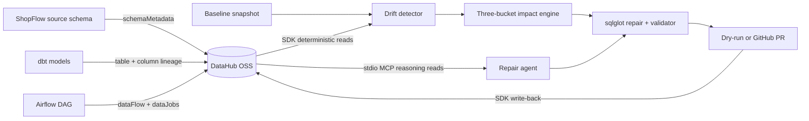

# Schema-Drift Auto-Repair Agent

The Schema-Drift Auto-Repair Agent turns DataHub metadata into a repair plan that can be
reviewed and shipped. When an upstream column is renamed, retyped, or dropped, it uses
column-level lineage to find the true blast radius, distinguishes code that must change
from downstream models already insulated by aliases, generates deterministic edits, and
validates every reference against the live catalog before a pull request can be opened.

This repository is a submission to the **Build with DataHub: The Agent Hackathon** in the
Metadata-Aware Code Generation & Development track. The included ShopFlow warehouse makes
the metadata story reproducible without a Snowflake account.

## What is here

- A production-shaped Python 3.11 project managed by `uv`.
- A typed DataHub integration layer for schemas, table and column lineage, usage queries,
  namespace discovery, MCP agent reads, and governance write-back.
- A complete dbt + Airflow demo warehouse with 5 raw tables, 5 staging models, 6 marts,
  explicit column lineage, schema tests, and a catalog-to-code map.
- An idempotent DataHub seed with a namespace-safe reset, live read-back verification, PII
  field tags, Airflow jobs, and a committed-style baseline schema snapshot.
- Three source drift scenarios—rename, retype, and drop—with lossless baseline reversion.
- Consistency tests proving SQL outputs, dbt YAML, and seeded lineage stay aligned.

Later slices add the deterministic patch engine, validator, OpenAI Agents SDK reasoning,
PR delivery, FastAPI service, and React control room. The foundation already models those
contracts so later layers share one JSON-serializable vocabulary.

## Architecture



DataHub reads intentionally use two surfaces: deterministic engine reads go through the
Python SDK, while the agent reasoning path uses the pinned `mcp-server-datahub` process.
Writes use the Python SDK. DataHub Cloud metadata proposals are not claimed here; on OSS,
the project uses incidents plus tags, documentation, institutional memory, lineage, and a
data-process instance as the governance record.

## Prerequisites

- Python 3.11 and [`uv`](https://docs.astral.sh/uv/)
- A DataHub quickstart whose GMS is exposed at `http://localhost:8081`
- DataHub UI at `http://localhost:9002`

Host port **8080 is deliberately not used**: it belongs to another application in the
reference environment. Every seed and verification command checks `/config` and refuses
to continue if the endpoint does not identify itself as DataHub GMS.

## One-command setup

```bash
make setup
```

Copy `.env.example` to your own `.env` only if you need to override defaults. A local
quickstart does not require `DATAHUB_GMS_TOKEN`. Never commit the resulting `.env`.

## Seed and verify DataHub

```bash
make seed
make verify
```

For a clean demo reset and the strongest live gate:

```bash
env -u VIRTUAL_ENV UV_CACHE_DIR=/private/tmp/uv-cache \
  uv run python scripts/seed_datahub.py --reset --verify
```

The reset is intentionally constrained to active dataset names beginning with
`shop_prod.`; it never nukes DataHub, touches containers, or deletes another project's
entities. The verification prints all 16 schemas and proves that
`orders.order_status` reaches strictly fewer downstream datasets than
`orders.order_placed_at`.

## Simulate source drift

```bash
env -u VIRTUAL_ENV UV_CACHE_DIR=/private/tmp/uv-cache \
  uv run python scripts/simulate_drift.py rename_order_placed_at

env -u VIRTUAL_ENV UV_CACHE_DIR=/private/tmp/uv-cache \
  uv run python scripts/simulate_drift.py --revert
```

Other scenarios are `retype_gross_amount` and `drop_marketing_opt_in`. Simulation only
re-emits the affected source `schemaMetadata`; it records the applied scenario but never
changes the baseline at `demo-warehouse/.repair-agent/snapshot.json`.

## Development checks

```bash
make test
make lint

cd demo-warehouse
env -u VIRTUAL_ENV UV_CACHE_DIR=/private/tmp/uv-cache \
  uv run --with dbt-core --with dbt-duckdb dbt parse
```

The demo dbt dependencies are optional, so the core agent installation stays lean.

## License

Licensed under the [Apache License 2.0](LICENSE).

