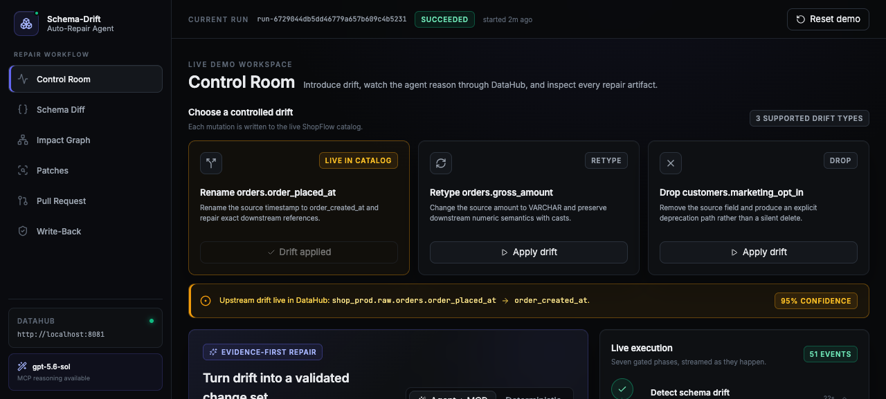
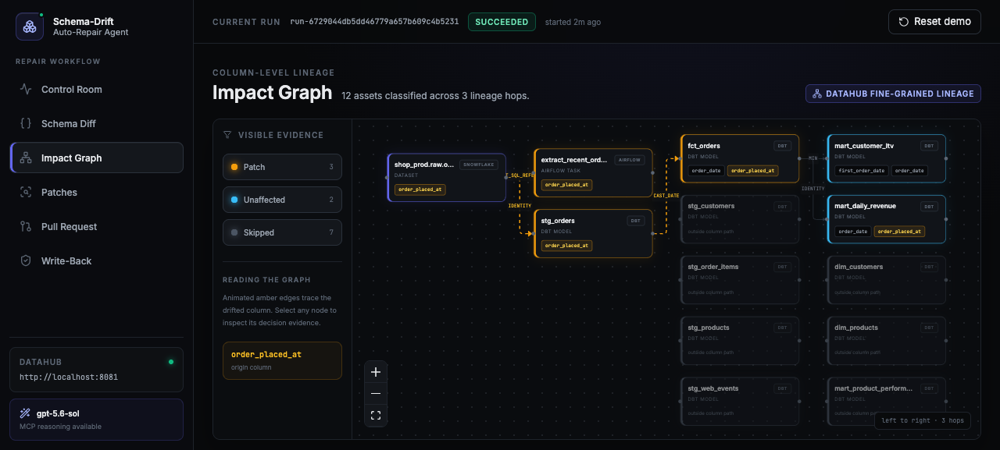
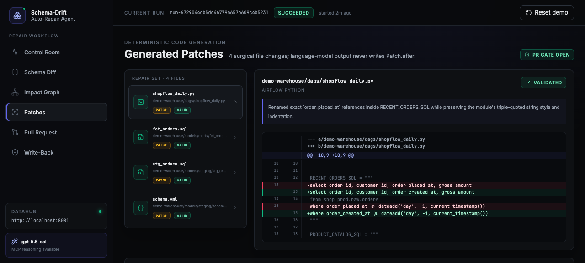
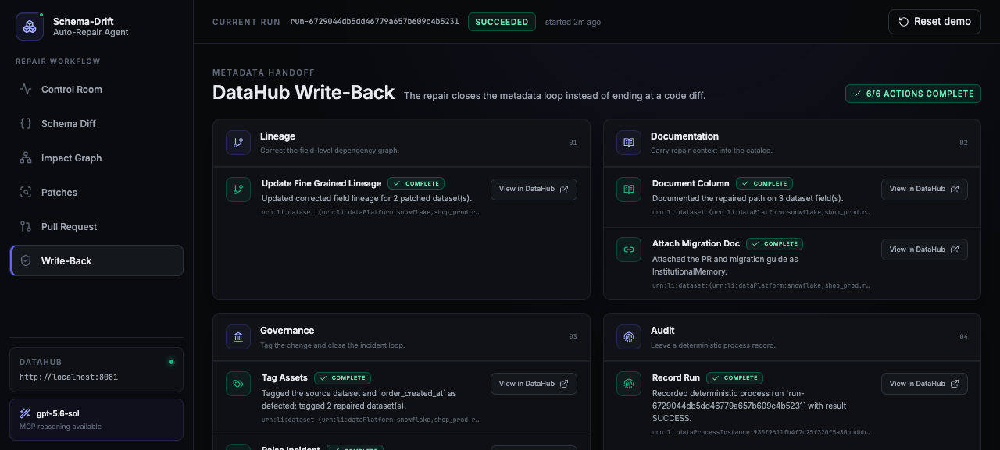
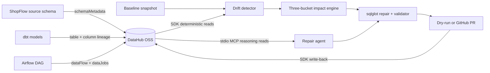

# Schema-Drift Auto-Repair Agent

An upstream team renames a column. Nothing errors. Four downstream models keep running and
quietly produce wrong numbers, and you find out three days later from a VP looking at a bad
dashboard.

This agent closes that loop. When a source column is **renamed, retyped, or dropped**, it
uses DataHub's **column-level lineage** to compute the true blast radius, separates code
that must change from downstream models that are already insulated, rewrites the affected
dbt SQL, `schema.yml`, and Airflow DAG code with **sqlglot AST edits**, validates every
single column reference against the live catalog before anything ships, opens a GitHub pull
request whose body carries the lineage evidence, and writes the repair back into DataHub so
the next engineer — or the next agent — inherits the knowledge.

Submitted to **Build with DataHub: The Agent Hackathon**, track *Metadata-Aware Code
Generation & Development*.

> **Most agents in this space generate new code from English. This one repairs existing
> code when the world changes underneath it.**

---

## Demo

| | |
|---|---|
|  |  |
| **Control Room** — introduce drift, watch the agent reason through DataHub live | **Impact Graph** — column-level blast radius, colour-coded by decision |
|  |  |
| **Patches** — surgical diffs with per-reference validation | **Write-Back** — six DataHub actions, each deep-linked |

A real pull request opened by the agent:
**[#2 Repair orders timestamp schema drift](https://github.com/yadneshSalvi/datahub-repair-agent/pull/2)**

---

## What makes it different

### 1. Three buckets, not two — precision you can audit

Grep gives you "every file containing the string". Table-level lineage gives you "everything
downstream". Neither is the answer. Using column-level lineage, every asset lands in one of
three buckets, **each with a stated reason**:

| Bucket | Meaning | In the demo |
|---|---|---|
| `REQUIRES_PATCH` | The file's SQL genuinely references the drifted column | `stg_orders`, `fct_orders`, and the Airflow task `extract_recent_orders` |
| `DOWNSTREAM_UNAFFECTED` | Inside the blast radius, but insulated by an alias created upstream — flagged for review, **not patched** | `mart_daily_revenue`, `mart_customer_ltv` (they read `order_date`, an alias created in `fct_orders`) |
| `SKIPPED` | Not on the changed column's lineage path at all | 7 models, each reported with *why* — e.g. *"consumes raw.orders but only order_id and order_status"* |

Reporting the skipped models **with reasons** is the point. It is what proves the agent
understood the graph instead of pattern-matching a string.

### 2. Zero hallucinated columns — enforced, not hoped

The language model never writes code. `sqlglot` parses the SQL to **locate** references, then
surgical text edits are applied to the original source, so a patch touches only the changed
tokens and nothing is reformatted. Then every column reference in the generated code is
resolved against the live catalog. **One unresolvable reference blocks the entire patch from
reaching a PR.**

Run the pipeline with and without the LLM and the generated code is byte-identical — there is
a test asserting exactly that. The model's only job is prose: the PR narrative, the risk note,
the migration doc.

### 3. It closes the metadata loop

The repair does not end at a diff. Updated column lineage, column documentation, tags, an
incident record, an institutional-memory link, and a process-instance run record all go back
into DataHub.

---

## Use of DataHub

DataHub is not a lookup here; it is the reasoning substrate. Both read surfaces are used
deliberately.

| Surface | Used for | Where |
|---|---|---|
| **MCP server** (`mcp-server-datahub`, stdio) | The **agent's** reasoning reads — `search`, `list_schema_fields`, `get_lineage`, `get_dataset_queries`, `get_lineage_paths_between` | `src/repair_agent/datahub_io/mcp.py`, `agent/runner.py` |
| **Python SDK** (`DataHubClient`) | The **engine's** deterministic reads — `lineage.get_lineage(source_column=…)` for the blast radius, `schemaMetadata` for the validation gate | `datahub_io/client.py` |
| **GraphQL** | Fine-grained lineage detail (`fineGrainedLineages`, `transformOperation`) and incidents | `datahub_io/client.py`, `writeback.py` |
| **Python SDK writes** | `upstreamLineage` + `fineGrainedLineages`, `EditableSchemaMetadata` column docs, tags, `InstitutionalMemory`, `DataProcessInstance` | `datahub_io/writeback.py` |

A single repair run fires **9–12 MCP tool calls**, visible live in the UI timeline.

**Column-level lineage is the load-bearing dependency**, and one undocumented rule makes or
breaks it: a fine-grained edge only renders if **both** the upstream and downstream dataset
carry a `schemaMetadata` aspect with exactly-matching `fieldPath`s, **and** table-level
`upstreams` coexists in the same aspect. `scripts/seed_datahub.py --verify` regression-tests
this, and asserts that the control column `orders.order_status` reaches strictly fewer
downstream datasets than `orders.order_placed_at`.

---

## Architecture



- **Agent** — OpenAI Agents SDK, model configurable (`gpt-5.6-sol` by default), DataHub MCP
  server attached, with a complete deterministic fallback.
- **Demo warehouse** — a real dbt project (5 raw sources, 5 staging models, 6 marts) plus an
  Airflow DAG, in `demo-warehouse/`. The agent opens PRs against this same repository, so the
  whole thing is reproducible with one clone and no Snowflake account.

---

## Quick start

**Prerequisites:** Python 3.11 + [`uv`](https://docs.astral.sh/uv/), Node 18+, and a DataHub
quickstart. Set `DATAHUB_GMS_URL` to wherever your GMS is exposed — this project defaults to
`http://localhost:8081` because host port 8080 was already taken in the reference environment.
Every command preflights `/config` and refuses to run against a non-DataHub endpoint.

```bash
make setup                 # uv sync + npm install
make seed                  # seed the ShopFlow catalog with column-level lineage
make verify                # prove the column-lineage contract holds
make demo                  # backend on :8002, UI on :3002
```

An `OPENAI_API_KEY` is optional. Without it the agent runs in deterministic mode and produces
identical patches with templated prose; the UI says so plainly.

### Try it

1. Open <http://localhost:3002> and click **Apply drift** on *Rename orders.order_placed_at*.
2. Click **Run repair agent** and watch the timeline — the monospace chips are real DataHub
   MCP calls happening live.
3. **Impact Graph**: 3 amber (patch), 2 sky (downstream, no change), 7 muted (correctly
   skipped). Click any node for its evidence.
4. **Patches**: surgical diffs and `23/23` references resolved.
5. **Pull Request**: the body with the Mermaid lineage evidence.
6. **Write-Back**: six DataHub actions, each with a working deep link.
7. **Reset demo** puts everything back.

Everything above also works from the CLI, which can drive the entire demo without the UI:

```bash
uv run repair-agent detect
uv run repair-agent impact rename-orders-order_placed_at
uv run repair-agent run    rename-orders-order_placed_at            # dry-run PR (default)
uv run repair-agent run    rename-orders-order_placed_at --no-llm   # identical patches
uv run repair-agent examples                                        # regenerate examples/
```

> **Re-running:** a successful run writes the repaired lineage back to DataHub, so an
> immediate second run correctly finds less to do. That is the agent working, not a bug.
> Use **Reset demo** (or `repair-agent seed --reset`) between takes.

---

## `examples/`

Real generated artifacts, committed, for all three drift types — before/after files, the
unified diff (which passes `git apply --check`), the impact report, the validation report,
generated dbt tests, the PR body, the write-back log, and the migration doc.

```
examples/rename_order_placed_at/    # RENAME  — the primary demo
examples/retype_gross_amount/       # RETYPE  — emits CAST wrappers
examples/drop_marketing_opt_in/     # DROP    — a deprecation path, never a silent delete
```

---

## Honest limitations

- **DataHub Cloud metadata proposals are not used, and not claimed.** They do not exist in
  OSS DataHub — there are zero `propose*` mutations in the OSS GraphQL schema. The governance
  substitute here is the OSS **incident** entity (raised in `TRIAGE`, moved to `FIXED` once
  the PR is open), plus dry-run review as the approval gate.
- **Dry-run is the default PR mode** so cloning this repo can never open a surprise pull
  request. Live mode is `--pr-mode live`.
- The warehouse is metadata-only; there is no live Snowflake connection. `dbt parse` runs
  against duckdb.
- Airflow support covers SQL held in module-level string constants (declared in
  `demo-warehouse/code_map.yml`).
- `get_dataset_assertions`, semantic search, and usage-based sorting are DataHub Cloud only;
  nothing here depends on them.

## Development

```bash
make test     # pytest
make lint     # ruff
cd web && npm run build
```

## License

Apache License 2.0 — see [LICENSE](LICENSE). All code in this repository was written during
the hackathon submission period.
