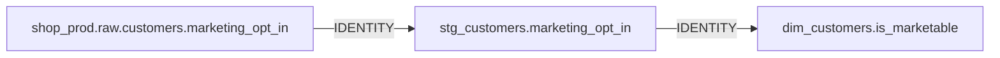

# Column-lineage evidence

```mermaid
graph LR
    n0["shop_prod.raw.customers.marketing_opt_in"] -->|"IDENTITY"| n1["stg_customers.marketing_opt_in"]
    n1["stg_customers.marketing_opt_in"] -->|"IDENTITY"| n2["dim_customers.is_marketable"]
```

## Captured DataHub queries

No usage query text was captured for this window; DataHub fine-grained lineage supplied the evidence above.
