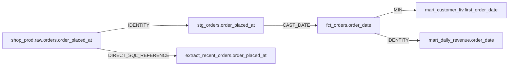

## Summary

Repair shop_prod.raw.orders: `order_placed_at` → `order_created_at` (RENAME, 0.95 confidence).

`order_placed_at` disappeared and `order_created_at` appeared with the same type TIMESTAMP_NTZ at the same ordinal position (3) — inferred as a rename with 0.95 confidence.

Updates references for the inferred rename `shop_prod.raw.orders.order_placed_at` → `order_created_at` across `extract_recent_orders`, `fct_orders`, `stg_orders`, and staging metadata. Output aliases and unrelated formatting are preserved. Validation: 23/23 resolved.

> **Risk note:** The rename was inferred with 0.95 confidence from matching type (`TIMESTAMP_NTZ`) and ordinal position (3). `mart_customer_ltv` and `mart_daily_revenue` are flagged for review only because they consume the upstream `order_date` alias.

## Lineage evidence

## Files changed

| File | Kind | Deterministic strategy |
|---|---|---|
| `demo-warehouse/dags/shopflow_daily.py` | airflow_python | Renamed exact `order_placed_at` references inside RECENT_ORDERS_SQL while preserving the module's triple-quoted string style and indentation. |
| `demo-warehouse/models/marts/fct_orders.sql` | dbt_sql | Renamed only exact AST column references from `order_placed_at` to `order_created_at`; output aliases and unrelated formatting were preserved. |
| `demo-warehouse/models/staging/stg_orders.sql` | dbt_sql | Renamed only exact AST column references from `order_placed_at` to `order_created_at`; output aliases and unrelated formatting were preserved. |
| `demo-warehouse/models/staging/schema.yml` | dbt_schema_yml | Renamed the `stg_orders.order_placed_at` dbt metadata entry, carried its description forward with provenance, and added a built-in test. |

### Reviewer checklist

- [ ] Confirm the inferred source-column rename.
- [ ] Verify exact references were updated without changing output aliases.
- [ ] Review the renamed `stg_orders` metadata entry, carried-forward description, and added built-in test.
- [ ] Confirm downstream marts consuming `order_date` remain unaffected.

## Validation — 0 hallucinated columns · 23/23 references resolved

Every column reference below was resolved before this PR was allowed to open. References to
datasets DataHub already knows about are checked against **live `schemaMetadata`**; references
to models patched earlier in this same repair set are checked against their **projected
post-repair schema**, because DataHub still holds their pre-repair schema until write-back.
A single unresolvable reference blocks the whole patch — the gate is enforced, not advisory.

| Table | Column | Line | Status | Evidence |
|---|---|---:|---|---|
| `shop_prod.raw.orders` | `order_id` | 2 | **OK** | Resolved `shop_prod.raw.orders.order_id` against the live DataHub schema. |
| `shop_prod.raw.orders` | `customer_id` | 2 | **OK** | Resolved `shop_prod.raw.orders.customer_id` against the live DataHub schema. |
| `shop_prod.raw.orders` | `order_created_at` | 2 | **OK** | Resolved `shop_prod.raw.orders.order_created_at` against the live DataHub schema. |
| `shop_prod.raw.orders` | `gross_amount` | 2 | **OK** | Resolved `shop_prod.raw.orders.gross_amount` against the live DataHub schema. |
| `shop_prod.raw.orders` | `order_created_at` | 4 | **OK** | Resolved `shop_prod.raw.orders.order_created_at` against the live DataHub schema. |
| `shop_prod.analytics.stg_order_items` | `order_id` | 5 | **OK** | Resolved `shop_prod.analytics.stg_order_items.order_id` against the live DataHub schema. |
| `shop_prod.analytics.stg_order_items` | `order_id` | 7 | **OK** | Resolved `shop_prod.analytics.stg_order_items.order_id` against the live DataHub schema. |
| `shop_prod.analytics.stg_orders` | `order_id` | 10 | **OK** | Resolved `shop_prod.analytics.stg_orders.order_id` against the projected repaired schema. |
| `shop_prod.analytics.stg_orders` | `customer_id` | 11 | **OK** | Resolved `shop_prod.analytics.stg_orders.customer_id` against the projected repaired schema. |
| `shop_prod.analytics.stg_orders` | `order_created_at` | 12 | **OK** | Resolved `shop_prod.analytics.stg_orders.order_created_at` against the projected repaired schema. |
| `shop_prod.analytics.stg_orders` | `order_status` | 13 | **OK** | Resolved `shop_prod.analytics.stg_orders.order_status` against the projected repaired schema. |
| `CTE i` | `item_count` | 14 | **OK** | Resolved `i.item_count` as a locally derived CTE output; its input references are validated separately. |
| `shop_prod.analytics.stg_orders` | `net_amount` | 15 | **OK** | Resolved `shop_prod.analytics.stg_orders.net_amount` against the projected repaired schema. |
| `shop_prod.analytics.stg_orders` | `order_id` | 17 | **OK** | Resolved `shop_prod.analytics.stg_orders.order_id` against the projected repaired schema. |
| `CTE i` | `order_id` | 17 | **OK** | Resolved `i.order_id` as a locally derived CTE output; its input references are validated separately. |
| `shop_prod.raw.orders` | `order_id` | 5 | **OK** | Resolved `shop_prod.raw.orders.order_id` against the live DataHub schema. |
| `shop_prod.raw.orders` | `customer_id` | 6 | **OK** | Resolved `shop_prod.raw.orders.customer_id` against the live DataHub schema. |
| `shop_prod.raw.orders` | `order_created_at` | 7 | **OK** | Resolved `shop_prod.raw.orders.order_created_at` against the live DataHub schema. |
| `shop_prod.raw.orders` | `order_status` | 8 | **OK** | Resolved `shop_prod.raw.orders.order_status` against the live DataHub schema. |
| `shop_prod.raw.orders` | `gross_amount` | 9 | **OK** | Resolved `shop_prod.raw.orders.gross_amount` against the live DataHub schema. |
| `shop_prod.raw.orders` | `gross_amount` | 10 | **OK** | Resolved `shop_prod.raw.orders.gross_amount` against the live DataHub schema. |
| `shop_prod.raw.orders` | `discount_amount` | 10 | **OK** | Resolved `shop_prod.raw.orders.discount_amount` against the live DataHub schema. |
| `shop_prod.raw.orders` | `order_status` | 12 | **OK** | Resolved `shop_prod.raw.orders.order_status` against the live DataHub schema. |

## Downstream but unaffected

- **mart_customer_ltv** — Reads `order_date`, aliases created upstream on the changed column's lineage path; `order_placed_at` does not appear in this file's SQL. Flagged for review only.
- **mart_daily_revenue** — Reads `order_date`, aliases created upstream on the changed column's lineage path; `order_placed_at` does not appear in this file's SQL. Flagged for review only.

## Correctly skipped

- **dim_customers** — In the table-level downstream graph, but consumes `stg_customers` columns {country_code, customer_id, email, full_name, marketing_opt_in, signup_date}; none is on the exact `shop_prod.raw.orders.order_placed_at` column-lineage path.
- **dim_products** — In the table-level downstream graph, but consumes `stg_products` columns {category, list_price, product_id, product_name, sku}; none is on the exact `shop_prod.raw.orders.order_placed_at` column-lineage path.
- **mart_product_performance** — In the table-level downstream graph, but consumes `dim_products` columns {category, product_id, sku}; `stg_order_items` columns {line_total, quantity}; none is on the exact `shop_prod.raw.orders.order_placed_at` column-lineage path.
- **stg_customers** — In the table-level downstream graph, but consumes `customers` columns {country_code, customer_id, email, full_name, marketing_opt_in, signup_date}; none is on the exact `shop_prod.raw.orders.order_placed_at` column-lineage path.
- **stg_order_items** — In the table-level downstream graph, but consumes `order_items` columns {order_id, order_item_id, product_id, quantity, unit_price}; none is on the exact `shop_prod.raw.orders.order_placed_at` column-lineage path.
- **stg_products** — In the table-level downstream graph, but consumes `products` columns {category, list_price, product_id, product_name, sku}; none is on the exact `shop_prod.raw.orders.order_placed_at` column-lineage path.
- **stg_web_events** — In the table-level downstream graph, but consumes `web_events` columns {customer_id, event_at, event_id, event_type, session_id}; none is on the exact `shop_prod.raw.orders.order_placed_at` column-lineage path.

## Captured queries

No captured usage queries were present in DataHub for this repair window; column lineage remains the impact authority.

## DataHub deep links

- [shop_prod.raw.orders](http://localhost:9002/dataset/urn%3Ali%3Adataset%3A%28urn%3Ali%3AdataPlatform%3Asnowflake%2Cshop_prod.raw.orders%2CPROD%29)
- [extract_recent_orders](http://localhost:9002/dataset/urn%3Ali%3AdataJob%3A%28urn%3Ali%3AdataFlow%3A%28airflow%2Cshopflow_daily%2CPROD%29%2Cextract_recent_orders%29)
- [fct_orders](http://localhost:9002/dataset/urn%3Ali%3Adataset%3A%28urn%3Ali%3AdataPlatform%3Adbt%2Cshop_prod.analytics.fct_orders%2CPROD%29)
- [stg_orders](http://localhost:9002/dataset/urn%3Ali%3Adataset%3A%28urn%3Ali%3AdataPlatform%3Adbt%2Cshop_prod.analytics.stg_orders%2CPROD%29)

---

Generated by **Schema-Drift Auto-Repair Agent** · run `run-6729044db5dd46779a657b609c4b5231` · DataHub `http://localhost:8081` · 2026-07-31T21:13:16.275712+00:00
