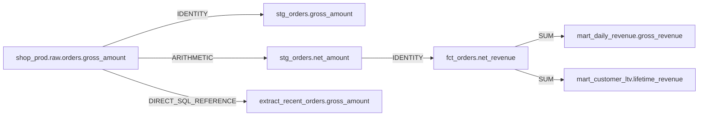

## Summary

Repair shop_prod.raw.orders: `gross_amount` → `gross_amount` (RETYPE, 1.00 confidence).

`gross_amount` remains present, but its native type changed from NUMBER(12,2) to VARCHAR(20) — detected as a retype.

The upstream retype was traced through DataHub column lineage. The deterministic engine generated 2 surgical patch(es), while 3 downstream model(s) were proven insulated and 7 asset(s) were skipped with explicit evidence.

> **Risk note:** Risk is bounded by the validator hard gate: 13/13 generated references resolved and no unresolved column is allowed into the PR. Review the lineage-derived skip reasons and deploy dbt models before dependent Airflow jobs.

## Lineage evidence

## Files changed

| File | Kind | Deterministic strategy |
|---|---|---|
| `demo-warehouse/dags/shopflow_daily.py` | airflow_python | Wrapped `gross_amount` references inside RECENT_ORDERS_SQL with CAST(... AS NUMBER(12,2)) to preserve semantics after the upstream VARCHAR(20) retype. |
| `demo-warehouse/models/staging/stg_orders.sql` | dbt_sql | Wrapped exact `gross_amount` references in CAST(... AS NUMBER(12,2)) to preserve downstream semantics after the upstream VARCHAR(20) retype. |

### Reviewer checklist

- [ ] Confirm the upstream schema change and rollout order with the source owner.
- [ ] Review every downstream-unaffected and correctly-skipped reason against the lineage graph.
- [ ] Run the dbt tests and dependent Airflow task in staging before production deployment.
- [ ] Verify the DataHub incident, field documentation, tags, and corrected column lineage after merge.

## Validation — 0 hallucinated columns · 13/13 references resolved

Every column reference below was resolved before this PR was allowed to open. References to
datasets DataHub already knows about are checked against **live `schemaMetadata`**; references
to models patched earlier in this same repair set are checked against their **projected
post-repair schema**, because DataHub still holds their pre-repair schema until write-back.
A single unresolvable reference blocks the whole patch — the gate is enforced, not advisory.

| Table | Column | Line | Status | Evidence |
|---|---|---:|---|---|
| `shop_prod.raw.orders` | `order_id` | 2 | **OK** | Resolved `shop_prod.raw.orders.order_id` against the live DataHub schema. |
| `shop_prod.raw.orders` | `customer_id` | 2 | **OK** | Resolved `shop_prod.raw.orders.customer_id` against the live DataHub schema. |
| `shop_prod.raw.orders` | `order_placed_at` | 2 | **OK** | Resolved `shop_prod.raw.orders.order_placed_at` against the live DataHub schema. |
| `shop_prod.raw.orders` | `gross_amount` | 2 | **OK** | Resolved `shop_prod.raw.orders.gross_amount` against the live DataHub schema. |
| `shop_prod.raw.orders` | `order_placed_at` | 4 | **OK** | Resolved `shop_prod.raw.orders.order_placed_at` against the live DataHub schema. |
| `shop_prod.raw.orders` | `order_id` | 5 | **OK** | Resolved `shop_prod.raw.orders.order_id` against the live DataHub schema. |
| `shop_prod.raw.orders` | `customer_id` | 6 | **OK** | Resolved `shop_prod.raw.orders.customer_id` against the live DataHub schema. |
| `shop_prod.raw.orders` | `order_placed_at` | 7 | **OK** | Resolved `shop_prod.raw.orders.order_placed_at` against the live DataHub schema. |
| `shop_prod.raw.orders` | `order_status` | 8 | **OK** | Resolved `shop_prod.raw.orders.order_status` against the live DataHub schema. |
| `shop_prod.raw.orders` | `gross_amount` | 9 | **OK** | Resolved `shop_prod.raw.orders.gross_amount` against the live DataHub schema. |
| `shop_prod.raw.orders` | `gross_amount` | 10 | **OK** | Resolved `shop_prod.raw.orders.gross_amount` against the live DataHub schema. |
| `shop_prod.raw.orders` | `discount_amount` | 10 | **OK** | Resolved `shop_prod.raw.orders.discount_amount` against the live DataHub schema. |
| `shop_prod.raw.orders` | `order_status` | 12 | **OK** | Resolved `shop_prod.raw.orders.order_status` against the live DataHub schema. |

## Downstream but unaffected

- **fct_orders** — Reads `net_amount`, aliases created upstream on the changed column's lineage path; `gross_amount` does not appear in this file's SQL. Flagged for review only.
- **mart_customer_ltv** — Reads `net_revenue`, aliases created upstream on the changed column's lineage path; `gross_amount` does not appear in this file's SQL. Flagged for review only.
- **mart_daily_revenue** — Reads `net_revenue`, aliases created upstream on the changed column's lineage path; `gross_amount` does not appear in this file's SQL. Flagged for review only.

## Correctly skipped

- **dim_customers** — In the table-level downstream graph, but consumes `stg_customers` columns {country_code, customer_id, email, full_name, marketing_opt_in, signup_date}; none is on the exact `shop_prod.raw.orders.gross_amount` column-lineage path.
- **dim_products** — In the table-level downstream graph, but consumes `stg_products` columns {category, list_price, product_id, product_name, sku}; none is on the exact `shop_prod.raw.orders.gross_amount` column-lineage path.
- **mart_product_performance** — In the table-level downstream graph, but consumes `dim_products` columns {category, product_id, sku}; `stg_order_items` columns {line_total, quantity}; none is on the exact `shop_prod.raw.orders.gross_amount` column-lineage path.
- **stg_customers** — In the table-level downstream graph, but consumes `customers` columns {country_code, customer_id, email, full_name, marketing_opt_in, signup_date}; none is on the exact `shop_prod.raw.orders.gross_amount` column-lineage path.
- **stg_order_items** — In the table-level downstream graph, but consumes `order_items` columns {order_id, order_item_id, product_id, quantity, unit_price}; none is on the exact `shop_prod.raw.orders.gross_amount` column-lineage path.
- **stg_products** — In the table-level downstream graph, but consumes `products` columns {category, list_price, product_id, product_name, sku}; none is on the exact `shop_prod.raw.orders.gross_amount` column-lineage path.
- **stg_web_events** — In the table-level downstream graph, but consumes `web_events` columns {customer_id, event_at, event_id, event_type, session_id}; none is on the exact `shop_prod.raw.orders.gross_amount` column-lineage path.

## Captured queries

No captured usage queries were present in DataHub for this repair window; column lineage remains the impact authority.

## DataHub deep links

- [shop_prod.raw.orders](http://localhost:9002/dataset/urn%3Ali%3Adataset%3A%28urn%3Ali%3AdataPlatform%3Asnowflake%2Cshop_prod.raw.orders%2CPROD%29)
- [extract_recent_orders](http://localhost:9002/tasks/urn%3Ali%3AdataJob%3A%28urn%3Ali%3AdataFlow%3A%28airflow%2Cshopflow_daily%2CPROD%29%2Cextract_recent_orders%29)
- [stg_orders](http://localhost:9002/dataset/urn%3Ali%3Adataset%3A%28urn%3Ali%3AdataPlatform%3Adbt%2Cshop_prod.analytics.stg_orders%2CPROD%29)

---

Generated by **Schema-Drift Auto-Repair Agent** · run `example-retype_gross_amount` · DataHub `http://localhost:8081` · 2026-08-01T00:36:08.929617+00:00
